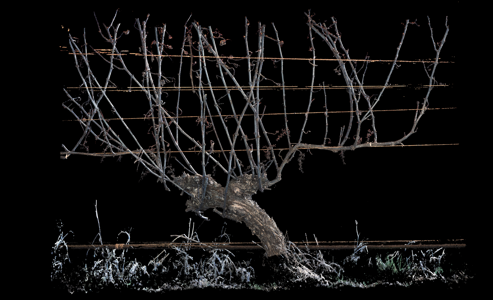

# NeRF-Reconstruction

Goal of this repo is to have a stable NeRF implementation to generate 3D point cloud reconstructions from calibrated camera scans.

### Inputs
Calibrated camera scans

### Outputs
Trained NeRF weights, surface pointcloud

## Basic usage
This project uses the [Hydra](https://hydra.cc/docs/intro/) configuration manager to store and mangange project parameters. This includes everything from dataloading, network hyperparameters, training, logging, etc... By default the config file used is located at `./nerf/configs/config.yaml`, so assuming the default parameters are correct, NeRF can be trained using the command below.

`python -m nerf.train`

To change any of these parameters overiding can be down via command line, such as changing the root dir for new loggin directories with the command below. More information on this can be found [here](https://hydra.cc/docs/advanced/override_grammar/basic/)

`python -m nerf.train log.root_dir=./nerf/logs/new_log_dir`

To change the configuration file used the specify the directory containing config files with `--config-path` flag and specify the config file (omitting the .yaml) using the `--config-name` flag. An example of this is shown below specifing a config file at `./new_config_dir/new_config.yaml`, and more information can be found [here](https://hydra.cc/docs/advanced/hydra-command-line-flags/)

`python -m nerf.train --config-dir=./new_config_dir --config-name=new_config`

## General overview of configuration parameters

### scan
 - scan_paths: List of paths to scan calibration files
 - scan_pose_paths: When using multible scans, location list of 4x4 numpy calibration matrix between scans, null/identity when single scan
 - frame_ranges: Specify (start, end) tuple for scans, null if using all scans
 - image_scale: Scale image size
 - inner_bound: Bound for the first part of the MipNeRF360 cooridinate system
 - outer_bound: Bound for the second part of the MipNeRF360 cooridinate system

### log
 - root_dir: directory where new logging directerys are saved
 - eval_image_freq: interger or 'end'
 - eval_pointcloud_freq: interger or 'end'
 - save_weights_freq: interger or 'end'

### trainer
 - num_epochs:
 - iters_per_epoch
 - n_rays: number of rays per iterataion
 - dist_loss_range: Tuple specificing (start, end) MipNeRF360 dist loss weighting during training, use (0, 0) to turn off
 - depth_loss_range: Tuple specificing (start, end) inverse depth loss, use (0, 0) to turn off

### optimizer

### schedular

### inference:

### renderer

### inference

### nets

## Methology Rundown

### NeRF
[NeRF](https://arxiv.org/pdf/2003.08934.pdf)

### NeRF in the Wild
[NeRF in the Wild](https://arxiv.org/pdf/2008.02268.pdf)

### MipNeRF360
[MipNeRF360](https://openaccess.thecvf.com/content/CVPR2022/papers/Barron_Mip-NeRF_360_Unbounded_Anti-Aliased_Neural_Radiance_Fields_CVPR_2022_paper.pdf)

### Surface Extraction

## TODO:
 - Minimal working implementation [x]
 - Correctness testing [x]
 - Consistant varible naming []
 - In code documentation []
 - Spec an API []